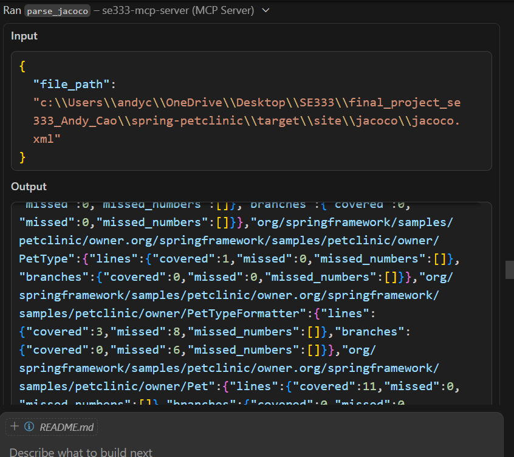
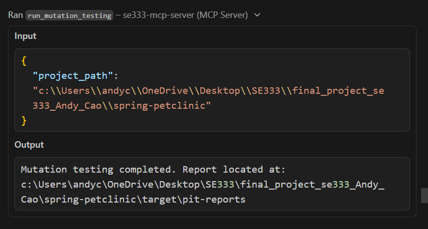

<h2>Technical Documentation</h2>
<b>Repository Where Agent Worked In: https://github.com/andycao998/final_project_se333_Andy_Cao</b>
<h3>MCP Tool/API Documentation</h3>
I added two MCP tools:  

1. <b>parse_jacoco</b>: I had AI generate this tool for me, but it takes the jacoco.xml report and condenses the information the AI agent needs to a dictionary of the line and branch coverage alongside missing coverage line numbers (I don't think this worked though). This is intended to make the AI's job easier so it doesn't have to manually parse the report and find the the missing coverage.
    * Input: file_path - file path of the report, which should be spring-petclinic/target/site/jacoco/jacoco.xml
    * Output: example - dict{Vets:{"lines":{"covered":4,"missed":0,"missed_numbers":[]},"branches":{"covered":2,"missed":0,"missed_numbers":[]}}}
    * Example Usage by AI Agent: 
    
    
2. <b>run_mutation_testing</b>: Also an AI generated tool that required a lot more work to configure. Runs mutation coverage using pitest for the AI agent and lets it know of the directory to find the results.
    * Input: project_path - file path of the project to be analyzed, spring-petclinic in this case
    * Output: Directory where pitest report is located
    * Note: in the end, I don't know how much the AI used the tool as it sometimes opted to run mvn pitest itself. 
    * Example Usage by AI Agent: 
    

<h3>Installation and Configuration Guide</h3>
<b>General actions (according to assignment instructions)</b>:

1. Initialize python virtual environment with uv package manager in CodeBase directory
2. Activate venv and install MCP + FastMCP dependencies
    * uv add "mcp[cli]" httpx fastmcp
3. Run python server.py and ensure the se333-MCP-server is running in mcp.json
4. Install Git MCP tools if needed and grant permission to GitHub
5. Ensure you can see the github and se333-mcp-server tools (specifically parse_jacoco and run_mutation_testing)

<b>Starting with this repository</b>: 

1. Initialize your own personal GitHub repository (to track AI commits).
2. Edit .github\prompts\tester.prompt.md to specify your personal repository where it should push changes
3. Remove all test cases in spring-clinic project
4. Send prompt to chat agent and run

<b>Analyzing a different repositority using my prompt</b>:

1. Edit .github\prompts\tester.prompt.md with your initialized Git repository and the project name you intend to analyze
2. Replace spring-petclinic folder with your selected project folder to analyze
3. Remove any existing test cases
4. Edit pom.xml to add the pitest plugin if it isn't already included in the project you selected:
    * In the build section include something like this (and ensure it compiles): 
    `<plugin>
    <groupId>org.pitest</groupId>
    <artifactId>pitest-maven</artifactId>
    <version>1.19.6</version>
    <dependencies>
        <dependency>
        <groupId>org.pitest</groupId>
        <artifactId>pitest-junit5-plugin</artifactId>
        <version>1.2.3</version>
        </dependency>
    </dependencies>
    </plugin>`
5. Send prompt to chat agent and run

<h3>Troubleshooting/FAQ</h3>

1. GitHub CoPilot asking if the agent should proceed
    * This happens after the agent has been running for a while and it will block execution until you click the popup to proceed. I haven't adjusted the max requests but you can try.
2. Token rate limiting
    * Sometimes will block you from proceeding and you'll have to wait a while before prompting the AI to continue again. For general token usage, I've found that compacting the conversation in the context window helps.
3. AI stuck on working step
    * Happened plenty of times on a step where it makes no progress no matter how long you wait. I don't know what's causing it or if there's a good solution. I just stop execution and prompt it to continue multiple times and eventually it might be able to get unstuck.
4. Finished work
    * After it finishes a portion of tests, the agent will give a report and stop execution. I found it helpful to resent the instructions prompt and add a bit of context to tell it not to edit existing test cases it used to get to 100% coverageon something.
5. Work not showing up in main
    * I couldn't get the Git process to be 100% automated as the agent will only push its work to the branch it created. Most of the time, it did not merge to main and so I had to go in and manually merge the branches it created.
6. General problem
    * The AI spends a long time dealing with failing tests on the mvn test step. Expect it to continue iterating and running mvn test with constant errors and adjustments (a lot of token usage). For my project, it seemed to get there eventually if I gave it long enough.
